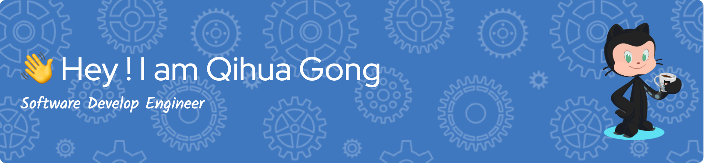

##  

<a href="https://github.com/GongQihua" target="_blank">

</a>
<a href="https://www.linkedin.com/in/qihua-gong-a1833a1b7/" target="_blank">

</a>
<a href="https://www.kaggle.com/qihuagong" target="_blank">

</a>  

### Glad to see you here! 

This is Qihua Gong from Shanghai, China. I'm currently a Software Engineer working on Full Sctack Development. I also participate in Game development in my spare time.

I graduated from the Johns Hopkins University with the Master degree of Electrical and Computer Engineering and the University of Missouri Columbia with the Bachelor degrees of Electrical Engineering and Minor in Mathematics.🥳  

```
████████████████████████████████████████████████████████████  ██╗  ██╗███████╗██╗     ██╗      ██████╗
████████████████████████████████████████████████████████████  ██║  ██║██╔════╝██║     ██║     ██╔═══██╗
███████████████████████████████████`.        ╙██████████████  ███████║█████╗  ██║     ██║     ██║   ██║
████████████████████████████████▀  ¿▓▓▓▓▓▓▓▓▄/ "████████████  ██╔══██║██╔══╝  ██║     ██║     ██║   ██║
██████████████████████████████▀.  ▓▓▓▓▓▓▓▓▓▓▓▓   ▐██████████  ██║  ██║███████╗███████╗███████╗╚██████╔╝▄█╗
██████████████████████████████ `  ▓▓▓▓▓▓▓▓▓▓▓▓  ` ██████████  ╚═╝  ╚═╝╚══════╝╚══════╝╚══════╝ ╚═════╝ ╚═╝
██████████████████████████████ `  ▓▓▓▓▓▓▓▓▓▓▓▓   ▄██████████
▀██████████████████████████████▌  ▀▀▓▓▓▓▓▓▓▌╓╖. ████████████  ███╗   ██╗██╗ ██████╗███████╗  ████████╗ ██████╗
█▄▀██████████████████████████████▄ ╩╦╙▀▀▀▀▀ ╣`,█████████████  ████╗  ██║██║██╔════╝██╔════╝  ╚══██╔══╝██╔═══██╗
▄▀█▄╙█████████████████████▀▀▀▀█████▄▄ .... ,▄███████▀███████  ██╔██╗ ██║██║██║     █████╗       ██║   ██║   ██║
██▄▀█▄╙█████████████████▀  ╪╢%╦══~╓,└ ╚▒▒▒ ╙▀|,╓╓═╤H   ▀████  ██║╚██╗██║██║██║     ██╔══╝       ██║   ██║   ██║
█▀▀▀-▀█▌▄▀█████████████   ║▒▒▒▒▒▒▒▒▒▒╢╦ ╘ -╣▒▒▒▒▒▒▒▒▒╢╕   ▀█  ██║ ╚████║██║╚██████╗███████╗     ██║   ╚██████╔╝
██▄▀██└║▄▄▄████████████▄          ═╕╕╕╕╕═╕═══════       ▄▄▄▄  ╚═╝  ╚═══╝╚═╝ ╚═════╝╚══════╝     ╚═╝    ╚═════╝
████▄▀█▌║███  ████████▌         ╕   ╩▒▒▒▒▒▒▒▒▒Ñ          ███
██████▌Ö▓▌   ▀██████████`╔▒▒╣ █ ▒▒m   ╚▒╢▒▒▒╩ -╣▒ ▌ ▒▒▒ ████  ███╗   ███╗███████╗███████╗████████╗  ██╗   ██╗ ██████╗ ██╗   ██╗
████ -"" ∞╙,▀.╙▀███████╜ ▒▒▒ ▄█ Ñ   -   S.  ═▒▒▒▒ █ ║▒▒╕└███  ████╗ ████║██╔════╝██╔════╝╚══██╔══╝  ╚██╗ ██╔╝██╔═══██╗██║   ██║
████████▄ -«   ∞▄.▀",╓═     ╒██   ═╣▒▒ `Ñ╛        █▌ ▒▒▒ ███  ██╔████╔██║█████╗  █████╗     ██║      ╚████╔╝ ██║   ██║██║   ██║
█████████▌ º     ╤╣▒╣╩^",▄▄███▀  ▒▒╣"     ''''''' ▀▀     `██  ██║╚██╔╝██║██╔══╝  ██╔══╝     ██║       ╚██╔╝  ██║   ██║██║   ██║
█████████  ▌       ▄▄████████─         ---------    L'▒▒▒ ██  ██║ ╚═╝ ██║███████╗███████╗   ██║        ██║   ╚██████╔╝╚██████╔╝
▀▀▀▀▀▀▀▀▀▀▀▀▀-     ▀▀▀▀▀▀▀▀▀▀       '╧╧╧╧╧╧╧╧╧`     ╚ ╧╧╧- ▀  ╚═╝     ╚═╝╚══════╝╚══════╝   ╚═╝        ╚═╝    ╚═════╝  ╚═════╝
```

## Research Interests  


- 🔭 Natural Language Processing.  
  

- 🌱 Machine learning in signal processing and medical imaging.  
  

- ⚡ Bioelectrical signal processing and Audio signal processing.

## Coding Area

- Full Stack Development

- Unity/Unreal Game Development

- IOS Development

## Languages and Tools

Software: C, C#, Python, Go, MATLAB, Swift.

Hardware: Arduino, Raspberry pi, Circuit design, AutoCAD, OrCAD Pspice.

AI Related: Machine learning, Deep learning, Audio signal process, Medical imaging process, Bioelectric signal process, NLP.

<p align="left"> <a href="https://www.arduino.cc/" target="_blank" rel="noreferrer">  </a> <a href="https://azure.microsoft.com/en-in/" target="_blank" rel="noreferrer">  </a> <a href="https://www.cprogramming.com/" target="_blank" rel="noreferrer">  </a> <a href="https://www.w3schools.com/cs/" target="_blank" rel="noreferrer">  </a> <a href="https://www.docker.com/" target="_blank" rel="noreferrer">  </a> <a href="https://dotnet.microsoft.com/" target="_blank" rel="noreferrer">  </a> <a href="https://www.electronjs.org" target="_blank" rel="noreferrer">  </a> <a href="https://git-scm.com/" target="_blank" rel="noreferrer">  </a> <a href="hexo.io/" target="_blank" rel="noreferrer">  </a> <a href="https://gohugo.io/" target="_blank" rel="noreferrer">  </a> <a href="https://developer.mozilla.org/en-US/docs/Web/JavaScript" target="_blank" rel="noreferrer">  </a> <a href="https://www.linux.org/" target="_blank" rel="noreferrer">  </a> <a href="https://www.mathworks.com/" target="_blank" rel="noreferrer">  </a> <a href="https://www.mysql.com/" target="_blank" rel="noreferrer">  </a> <a href="https://opencv.org/" target="_blank" rel="noreferrer">  </a> <a href="https://pandas.pydata.org/" target="_blank" rel="noreferrer">  </a> <a href="https://www.python.org" target="_blank" rel="noreferrer">  </a> <a href="https://pytorch.org/" target="_blank" rel="noreferrer">  </a> <a href="https://www.qt.io/" target="_blank" rel="noreferrer">  </a> <a href="https://scikit-learn.org/" target="_blank" rel="noreferrer">  </a> <a href="https://www.sketch.com/" target="_blank" rel="noreferrer">  </a> <a href="https://www.sqlite.org/" target="_blank" rel="noreferrer">  </a> <a href="https://developer.apple.com/swift/" target="_blank" rel="noreferrer">  </a> <a href="https://www.tensorflow.org" target="_blank" rel="noreferrer">  </a> <a href="https://unity.com/" target="_blank" rel="noreferrer">  </a> </p>


## Github Stats  
<table><tr><td valign="top" width="50%">


</td><td valign="top" width="50%">


</td></tr></table>  

<br/>   

[](https://github.com/KnlnKS/leetcode-stats)

<br><br>

<br/>  

  
  

<br/>  

